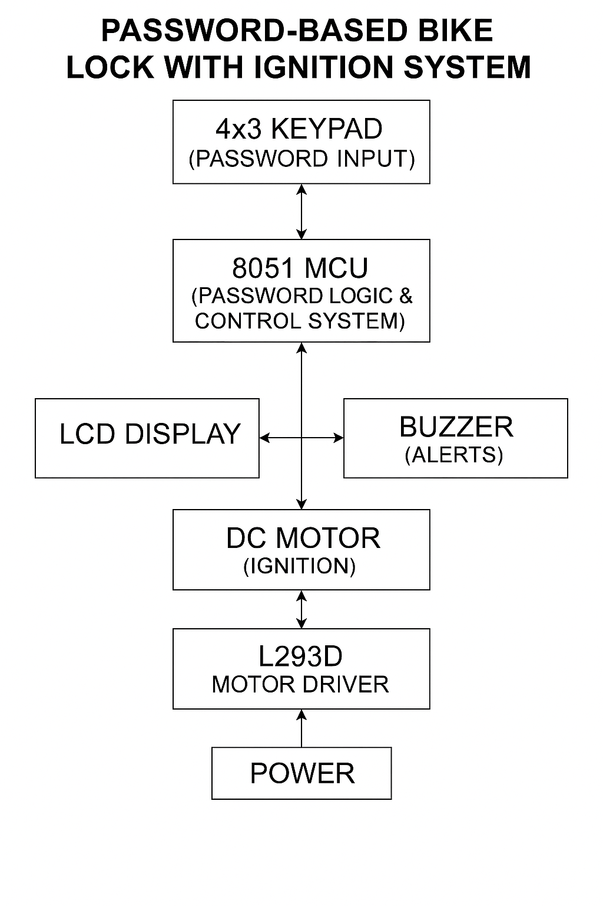
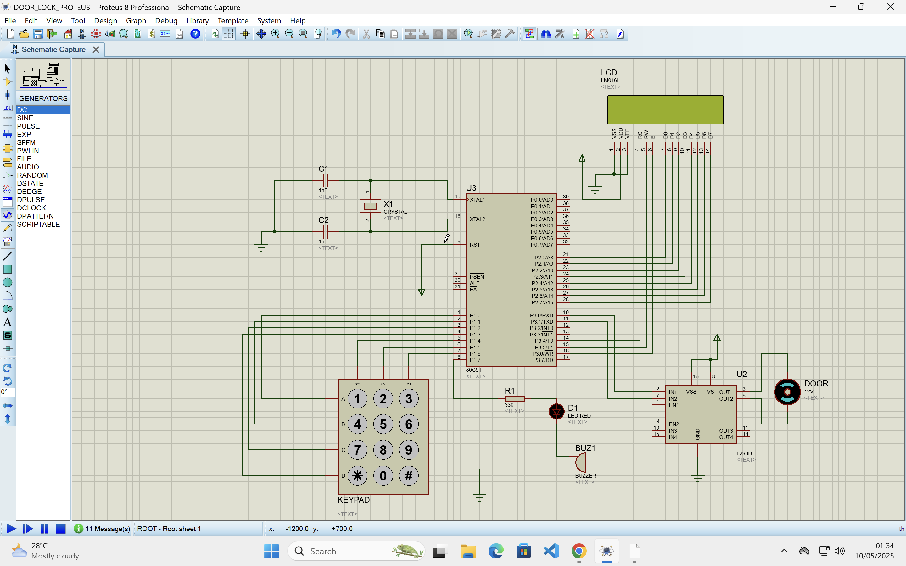

# Password-based Lock for Bike Ignition key System using 8051 Microcontroller

This project is a simulated hardware security system for bike ignition using a password mechanism implemented via 8051 microcontroller, 4x3 keypad, LCD, and Proteus simulation.

## 🚀 Features
- Password-based authentication to **start the bike**
- **Three incorrect password attempts trigger bike lock**
- **Countdown warning** on LCD before locking
- LCD shows:
  - **"Bike On" and "Enjoy The Ride" upon success**
  - Attempt reminders after wrong entries
- Displays speedometer & odometer by default
- Prevents repeated ignition after startup

---
## 🛠️ Project Components

### 👨‍💻 Software:
- **Keil uVision** – for 8051 coding and HEX generation
- **Proteus Design Suite** – for simulating microcontroller circuit

## 🧩 Hardware Simulated
- 80C51 Microcontroller  
- Programming Cable  
- 4x3 Matrix Keypad  
- 16x2 LCD Display  
- DC Motor  
- Capacitor  
- Crystal Oscillator  
- L293D Push-Pull Four Channel Driver with Diodes  
- Buzzer  
- Power Source  
- Ground Connections  

---

## 📂 Project Structure

| File Name                     | Description                                  |
|------------------------------|----------------------------------------------|
| `lock_s.c`                   | Source code for password-based ignition lock |
| `lock.hex`                   | HEX file generated from Keil for simulation  |
| `lock_s.obj`, `lock.lnp`, etc| Build output files                           |
| `lock.uvopt`                 | Keil project options                         |
| `bike_ignition_code.pdf`     | Code in PDF format                           |
| `bike_ignition_diagram.pdf`  | Circuit/block diagram (PDF)                  |
| `Bike_ignition.*`            | Proteus design files (`.PDSPRJ`, `.HGL`, etc)|
| `LICENSE`                    | License file                                 |
| `README.md`                  | Project documentation                        |

---

## 🔧 How to Run

1. Open `BikeLock.uvproj` in **Keil**.
2. Build the project to generate `BikeLock.hex`.
3. Open Bike_ignition.PDSPRJ in **Proteus**.
4. Load the `BikeLock.hex` into the 8051 microcontroller in the Proteus design.
5. Run the simulation and test the system using the keypad.

---
## 📝 Password Logic

- Default password: **`54321`**
- If entered correctly:
  - Displays: `Bike On`, then `Enjoy The Ride`
  - Returns to speedometer and odometer screen
- If entered incorrectly:
  - Displays remaining attempts (e.g., `2 attempts left`)
  - After 3 failed attempts:
    - LCD shows countdown
    - Buzzer activates
    - System locks

---

## 📊 Block Diagram

---

## 📎 Code and Circuit PDFs

- [bike_ignition_code.pdf](bike_ignition_code.pdf)
- [bike_ignition_diagram.pdf](bike_ignition_diagram.pdf)
- 

To view these PDFs directly on GitHub, click the filenames above.

---

## 📜 License

This project is licensed under the [MIT License](LICENSE).

---

## 👤 Author

-Developed by: Tasnim Ul Islam
-Department : Bioinformatics Engineering,AET
-Institution: Bangladesh Agricultural University  

---

